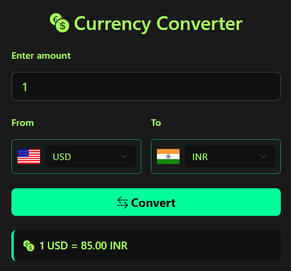

# 💱 Currency Converter

A simple and elegant **Currency Converter Web App** built using **HTML**, **CSS**, **Bootstrap**, and **Vanilla JavaScript**. This project performs **static currency conversions** without relying on any external API — ideal for learning the fundamentals of UI/UX and DOM manipulation.

---

## 🚀 Features

- 🔢 **Real-Time Conversion** using hardcoded exchange rates.
- 🌐 **Dynamic Flag Icons** that update based on selected currencies.
- 🎯 **Input Validation** for accurate and user-friendly interactions.
- 🎨 **Modern Neon Dark UI** styled using custom CSS and Bootstrap.
- 📱 **Responsive Design** that works seamlessly on desktops.

---

## 🛠️ Technologies Used

| Technology  | Purpose                              |
|-------------|--------------------------------------|
| **HTML5**   | Structure and layout of the app      |
| **CSS3**    | Custom styling and visual design     |
| **Bootstrap 5** | Responsive layout and components |
| **JavaScript (Vanilla)** | Currency logic, flag updates, form handling |

---

## 📸 UI Preview

> ✅ Clean layout with light neon green highlights  
> ✅ Currency selector with country flags  
> ✅ Convert button with hover animation  
> ✅ Inline message displaying the conversion result  

---

## 🔍 How It Works

1. **User enters an amount** to be converted.
2. **Selects currencies** from "From" and "To" dropdowns.
3. On clicking **Convert**, the static exchange rates are used to calculate the output.
4. The **result is shown dynamically** without page reload.